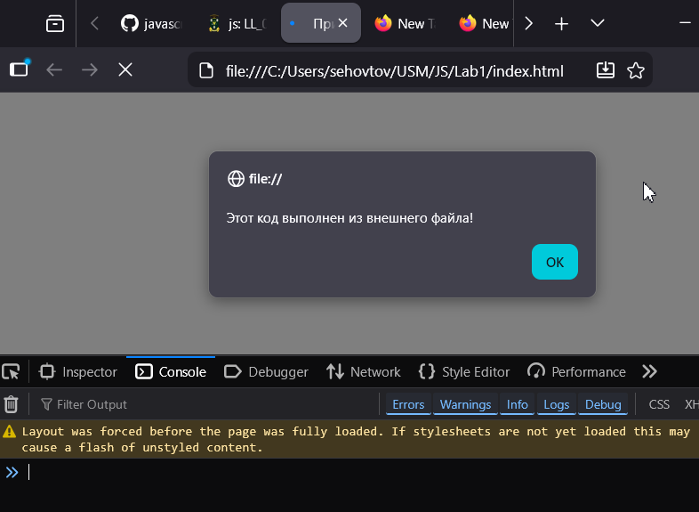
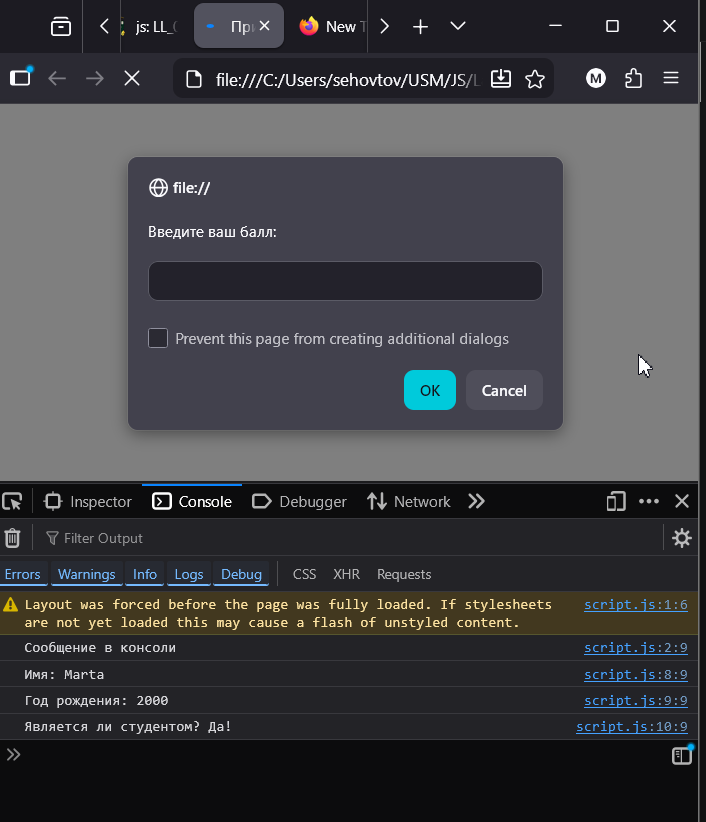
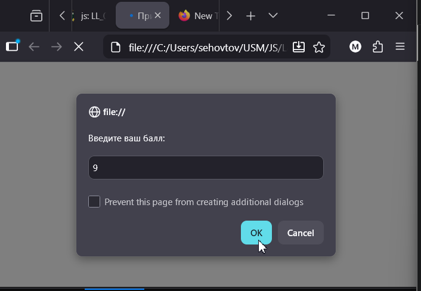
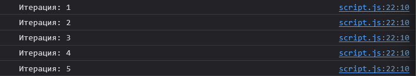

## 1. Инструкции по запуску проекта

1. Скачать проект на компьютер.
2. Открыть папку проекта.
3. Запустить файл `index.html` в браузере.
4. Открыть инструменты разработчика (F12):
5. Перейти во вкладку `Console`.
6. Выполнить ввод данных при появлении окна `prompt`.

 ## 2. Описание лабораторной работы
Цель - познакомиться с основами JavaScript, научиться писать и выполнять код в браузере и в локальной среде, разобраться с базовыми конструкциями языка.

В процессе выполнения работы были изучены:
- создание переменных;
- использование `alert()` и `prompt()`;
- вывод информации через `console.log()`;
- использование условных операторов;
- применение циклов.

## 3.Краткая документация к проекту
Программа выполняет следующие действия:

- выводит сообщение через `alert`;
- выводит текст в консоль;
- создает переменные с данными пользователя;
- отображает информацию в консоли;
- запрашивает у пользователя балл;
- анализирует введенное значение;
- выводит результат проверки;
- выполняет цикл от 1 до 5.

## 4.Примеры использования проекта с приложением скриншотов или фрагментов кода.
Можно увидеть,что код выполнен из внешнего файла.

Можно увидеть информацию обо мне.

Можно ввести балл и получить фидбек

Можно увидеть работу цикла

## 5. Ответы на контрольные вопросы
Чем отличается var от let и const? 
- `var` — старый способ объявления переменных.
- `let` — позволяет изменять значение переменной.
- `const` — не позволяет изменять ссылку на значение.

Что такое неявное преобразование типов в JavaScript?
Неявное преобразование типов — это автоматическое изменение типа данных JavaScript во время выполнения.

Как работает оператор == в сравнении с ===?
`==` сравнивает значения и может автоматически преобразовывать типы
`===` сравнивает значения и типы одновременно.

## 6. Список использованных источников
https://github.com/MSU-Courses/javascript/
https://developer.mozilla.org/en-US/