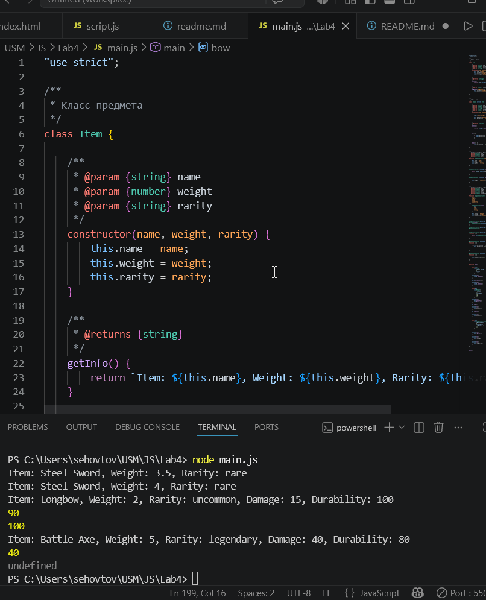

# Лабораторная работа №4. Продвинутые объекты в JavaScript

## 1. Инструкции по запуску проекта

1. Скачать проект на компьютер.
2. Открыть папку проекта в IDE, например Visual Studio Code.
4. Убедиться, что установлен Node.js.
5. Открыть встроенный терминал в IDE.
6. Запустить программу командой: node main.js

## 2. Описание лабораторной работы

Цель работы: познакомиться с классами и объектами в JavaScript, научиться создавать классы, использовать конструкторы и методы, а также реализовать наследование.

В данной лабораторной работе было создано консольное приложение, моделирующее систему инвентаря. В программе можно создавать предметы, изменять их свойства, использовать оружие и восстанавливать его прочность.

В работе были использованы:

- классы;
- объекты;
- конструкторы;
- методы;
- наследование;
- функции-конструкторы;
- прототипы;
- опциональная цепочка;
- JSDoc-комментарии.

## 3. Краткая документация к проекту

Проект состоит из файла `main.js`.

В программе реализованы классы Item и Weapon:

Класс `Item` описывает обычный предмет инвентаря.

Поля класса:

- `name` — название предмета;
- `weight` — вес предмета;
- `rarity` — редкость предмета.

Методы класса:

- `getInfo()` — возвращает информацию о предмете;
- `setWeight(newWeight)` — изменяет вес предмета.

Класс `Weapon` наследуется от класса `Item` и описывает оружие.

Дополнительные поля:

- `damage` — урон оружия;
- `durability` — прочность оружия.

Методы класса:

- `getInfo()` — возвращает информацию об оружии;
- `use()` — уменьшает прочность оружия на 10;
- `repair()` — восстанавливает прочность до 100.

Также в проекте реализованы функции-конструкторы:

- `ItemConstructor`;
- `WeaponConstructor`.

Они выполняют ту же задачу, что и классы, но используют старый способ создания объектов через функции и прототипы.

## 4. Примеры использования проекта

Можно создать обычный предмет:
const sword = new Item("Steel Sword", 3.5, "rare");

Можно создать оружие:
const bow = new Weapon("Longbow", 2.0, "uncommon", 15, 100);

Для предметов можно:
получать информацию о предмете;
изменять вес предмета.

Для оружия можно:
получать информацию об оружии;
изменять вес;
использовать оружие;
восстанавливать прочность.

Вывод программы:

## 5. Ответы на контрольные вопросы

Какое значение имеет this в методах класса?

`this` в методах класса указывает на текущий объект, у которого был вызван метод.

 Как работает модификатор доступа # в JavaScript?

Символ `#` используется для создания приватных полей и методов класса.

Приватное поле доступно только внутри класса. Снаружи напрямую обратиться к нему нельзя.

В чем разница между классами и функциями-конструкторами?

Классы — это современный и более удобный способ создания объектов в JavaScript.

Функции-конструкторы — это старый способ создания объектов, который использовался до появления классов.

Главная разница:

- классы читаются проще;
- в классах удобнее писать наследование через `extends`;
- функции-конструкторы используют `prototype`;
- классы являются более современным синтаксисом.

## 6. Список использованных источников
https://github.com/MSU-Courses/javascript/
https://developer.mozilla.org/en-US/

## 7. Дополнительные важные аспекты

Код проекта задокументирован с использованием JSDoc. Это делает программу более понятной и помогает другим разработчикам быстрее разобраться в назначении классов, функций и методов.

Также в работе показаны два способа создания объектов:

- современный способ через `class`;
- старый способ через функции-конструкторы.

Дополнительно была использована опциональная цепочка `?.`, которая помогает безопасно обращаться к свойствам объектов и избегать ошибок при отсутствии нужного свойства.
