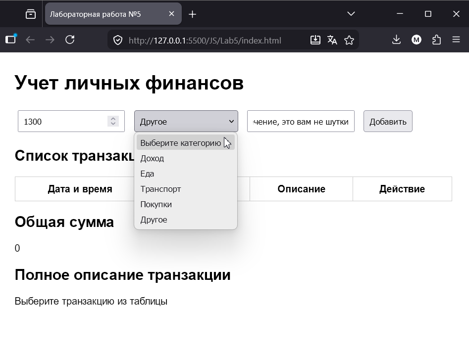
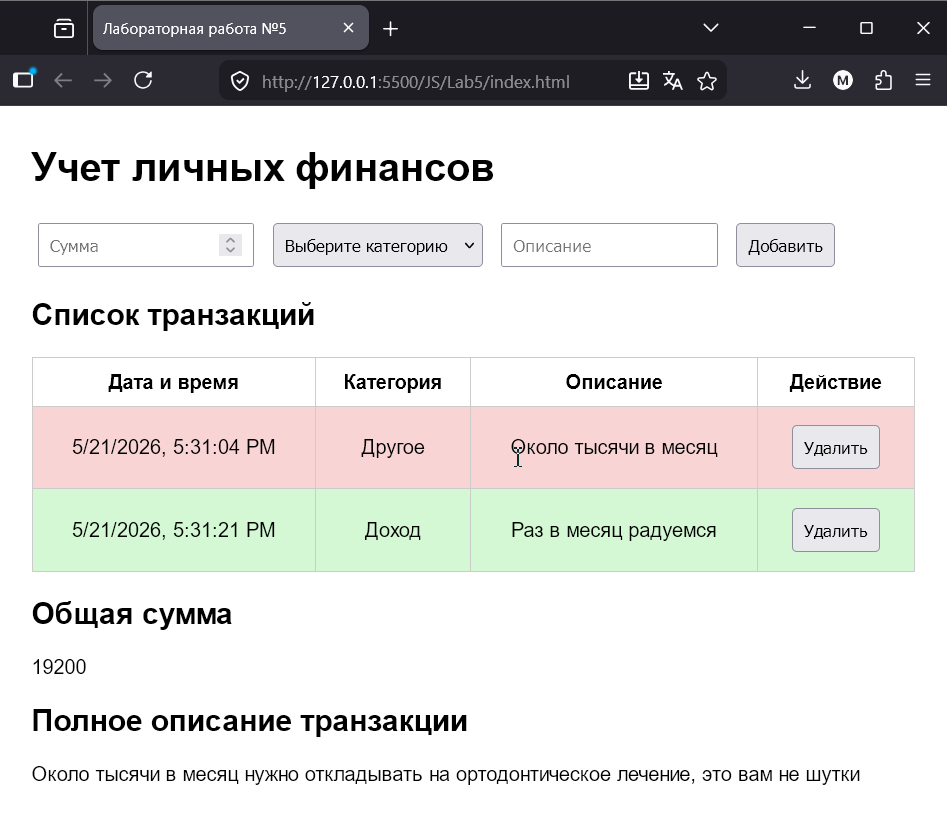

# Лабораторная работа №5. Работа с DOM-деревом и событиями в JavaScript

## 1. Инструкции по запуску проекта

1. Скачать проект на компьютер.
2. Открыть папку проекта в IDE, например Visual Studio Code.
4. Установить расширение `Live Server`, если оно еще не установлено.
5. Открыть файл `index.html`.
6. Нажать правой кнопкой мыши по файлу `index.html`.
7. Выбрать `Open with Live Server`.
8. В браузере откроется страница проекта.

## 2. Описание лабораторной работы

Цель работы: ознакомиться с основами взаимодействия JavaScript с DOM-деревом на основе веб-приложения для учета личных финансов.

В ходе работы было создано веб-приложение, которое позволяет добавлять, отображать и удалять транзакции, а также считать общую сумму.

## 3. Краткая документация к проекту

Структура проекта:

Lab5
├── index.html
├── style.css
└── src/
    ├── index.js
    ├── transactions.js
    ├── ui.js
    └── utils.js

В программе можно:

- добавлять транзакции;
- удалять транзакции;
- просматривать краткое описание;
- просматривать полное описание;
- видеть общую сумму;
- видеть доход зеленым цветом;
- видеть траты красным цветом.

## 4. Примеры использования проекта

Можно добавить транзакцию заполнив сумму, описание,выбрав категорию и нажав кнопку"Добавить"

Можно удалять транзакции при помощи кнопки Удалить

При нажатии на поле таблицы, ниже появится полное описание транзакции

Общая сумма отражает остаток.

## 5. Ответы на контрольные вопросы

Каким образом можно получить доступ к элементу на веб-странице с помощью JavaScript?

Получить доступ к элементу можно с помощью `document.querySelector()`:

Что такое делегирование событий и как оно используется для эффективного управления событиями на элементах DOM?

Делегирование событий — это подход, когда обработчик события ставится на родительский элемент, а не на каждый дочерний элемент отдельно.

Как можно изменить содержимое элемента DOM с помощью JavaScript после его выборки?

Содержимое элемента можно изменить через `textContent`:

Как можно добавить новый элемент в DOM дерево с помощью JavaScript?

Новый элемент можно создать через `document.createElement()`, а затем добавить через `append()`:

## 6. Список использованных источников
https://github.com/MSU-Courses/javascript/

https://developer.mozilla.org/en-US/

## 7. Дополнительные важные аспекты

Код проекта разделен на модули.

В проекте используется `type="module"`, поэтому JavaScript-файлы могут импортировать и экспортировать функции.

Также используется делегирование событий: обработчик клика назначен на таблицу, а не на каждую кнопку удаления отдельно.
