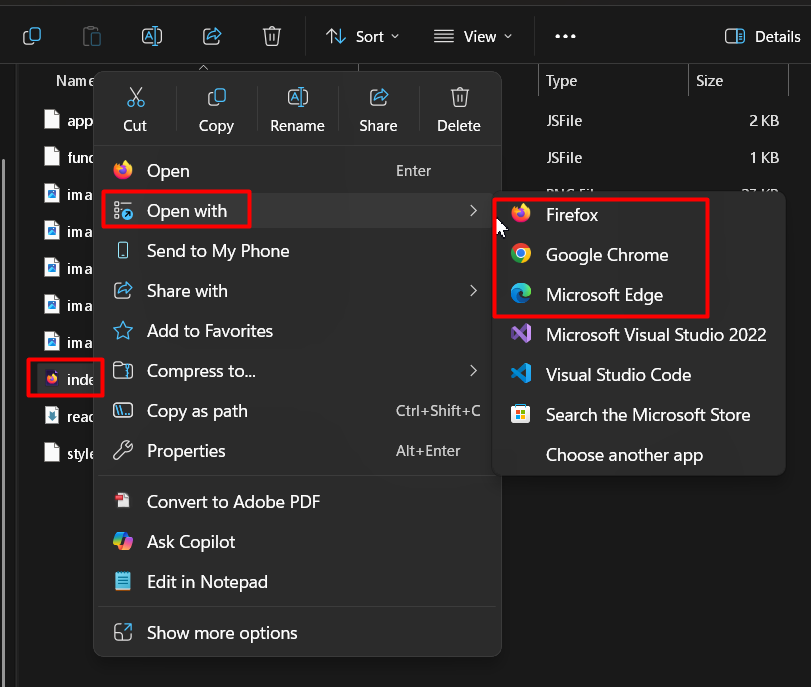
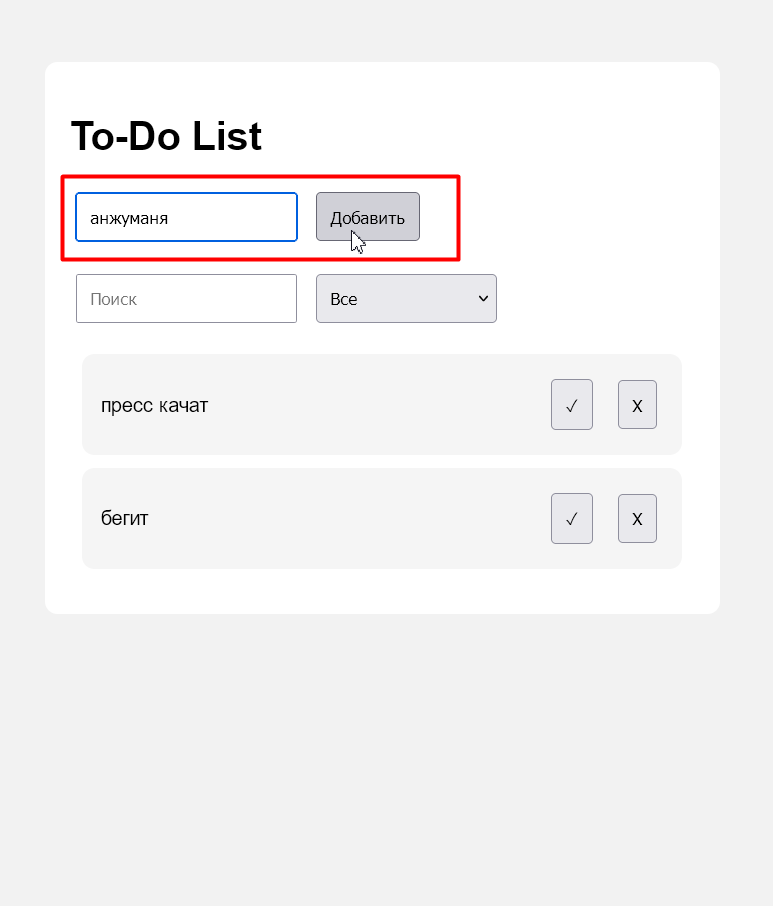
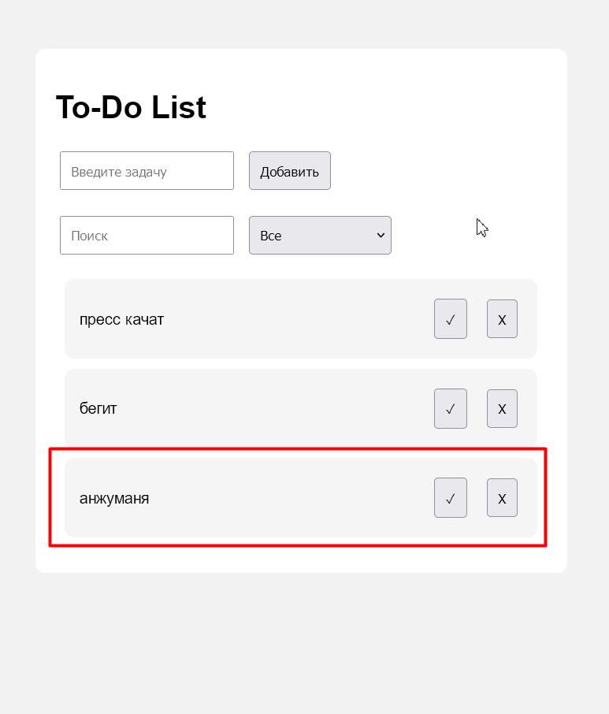
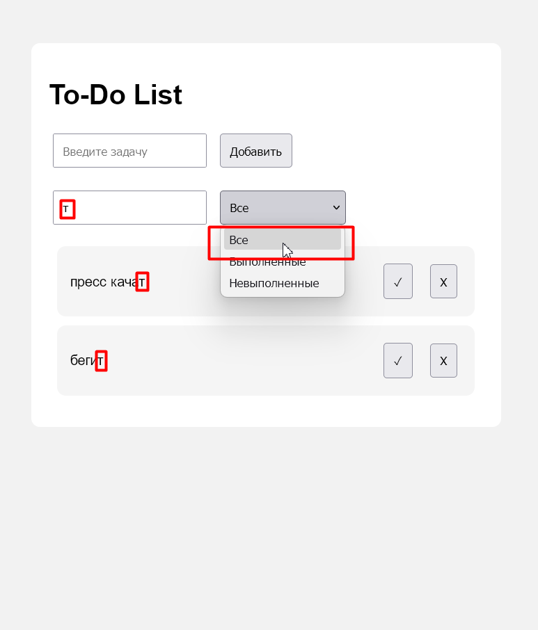
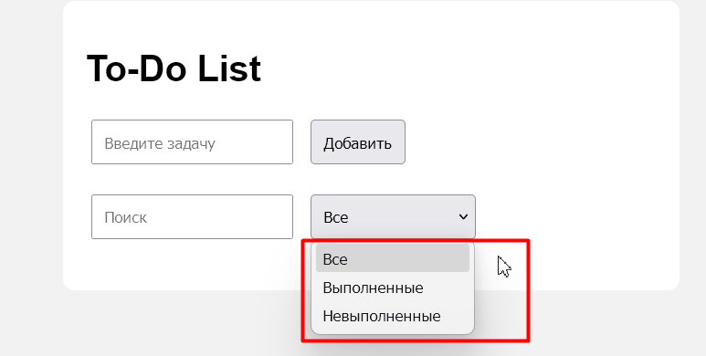
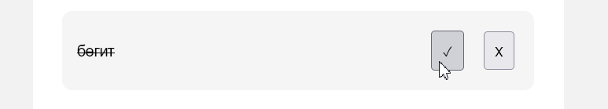

# To-Do List
---
## Инструкции по установке и запуску

1. Скачать проект на компьютер.
2. Открыть папку проекта.
3. Найти файл `index.html`.
4. Открыть файл `index.html` c помощью браузера.

После этого приложение откроется в браузере и будет готово к использованию.

---
## Авторы проекта

Marta Sehovtov

---
## Описание проекта

To-Do List это веб-приложение для управления списком задач.

Цель проекта - создать инструмент для добавления, просмотра и управления задачами с использованием JavaScript и работы с DOM.

Основные функции проекта:

- добавление новой задачи;
- удаление задачи;
- отметка задачи как выполненной;
- поиск задач;
- фильтрация задач:
  - все задачи;
  - выполненные;
  - невыполненные;
- проверка пользовательского ввода;
- динамическое изменение элементов страницы.

---

## Примеры использования

### Добавление задачи

Пользователь вводит текст задачи и нажимает кнопку добавить:

После добавления задача появляется в списке:

### Поиск задач

При вводе текста приложение отображает подходящие задачи в выбранной категории.:

### Сортировка задач
Задачи можно фильтровать по статусу

### Отметка выполнения

При нажатии на галочку текст задачи перечернут, задача меняет статус на "выполнена":

при повторном нажатии задача снова меняет статус.

### Удаление задачи
При нажатии на X задача удаляется.
---

## Использованные источники

1.Материалы курса GitHub- https://github.com/MSU-Courses/javascript

---

## Дополнительная информация

Проект использует модульный подход:

- `functions.js` отвечает за работу функций;
- `app.js` отвечает за взаимодействие с DOM.

Данные хранятся в массиве объектов и не используют базу данных. После обновления страницы список задач очищается.